# Tutorial de Instalación

## Instalación del Launcher

1. **Descarga la carpeta "AndesCraft 2.0"**:
   - Accede al siguiente enlace y descarga la carpeta completa: [Google Drive - AndesCraft 2.0](https://drive.google.com/drive/u/1/folders/1VMCZAj6vhVSMbUUJo3S2CPWpwzznwGUD)

2. **Descomprime los archivos necesarios**:
   - Navega a la carpeta descargada "AndesCraft 2.0", descomprímela, y abre la carpeta "launcher".

3. **Instala OpenJDK**:
   - Ejecuta el archivo `OpenJDK21U-jdk_x64_windows_hotspot_21.0.3_9.msi` y sigue las instrucciones del instalador para instalar OpenJDK en tu computadora.

### Paso a Paso (Launcher)

1. **Abrir SKlauncher**:
   - Abre el archivo `SKlauncher-3.2`.

2. **Cambiar a modo sin conexión**:
   - Haz clic en el botón que dice "Cambiar a modo sin conexión".

   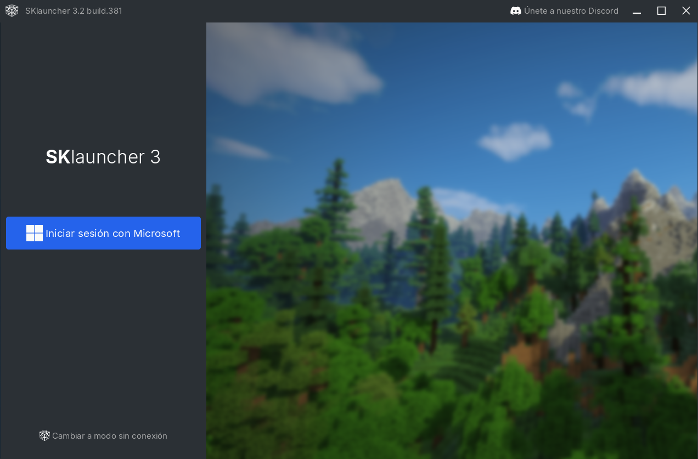

3. **Iniciar sesión sin conexión**:
   - Inserta el nombre que deseas usar dentro del servidor y haz clic en el botón "Iniciar sesión sin conexión".

   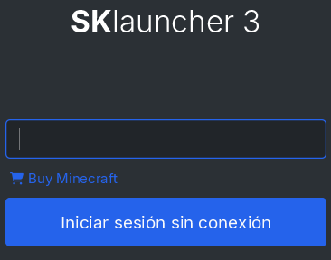

4. **Configurar una nueva instalación**:
   - En la parte superior izquierda de la ventana, haz clic en el símbolo +, al lado de donde dice "Administrador de Instalación".

   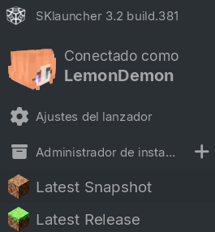

5. **Seleccionar la versión de Forge**:
   - Coloca el nombre que quieras a tu instalación (por ejemplo, 1.16.5). Luego, en "Versión", haz clic en Forge. Finalmente, justo abajo de eso, haz clic sobre el número de versión de la izquierda, y busca la versión "1.16.5". Si todo está bien, deberías ver algo así:

   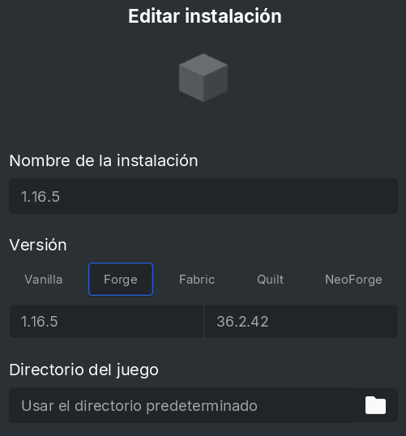

   - Una vez que crees la instalación, deberías ver un archivo con el nombre que le colocaste, como se ve a continuación:

   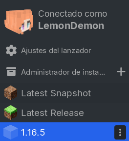

6. **Ejecutar Minecraft**:
   - Justo debajo de eso, haz clic en el botón azul que dice "JUGAR". Al hacerlo, se estarán instalando algunos archivos. Una vez que Minecraft se abra correctamente, cierra la pestaña. Esto lo hacemos para que se creen las carpetas necesarias para instalar los mods.

Si todo ha salido bien, ¡felicidades!, ya tienes Minecraft Forge instalado correctamente. A continuación, te enseñaremos a instalar los mods.

## Instalación de Mods

### Paso a Paso (Mods)

1. **Abrir el directorio de instalación**:
   - Si ya completaste todos los pasos del apartado anterior, debemos volver a la pestaña del launcher.

   

   - Haz clic en los tres puntos verticales que ves en el archivo. Luego, haz clic en "Abrir el directorio de la instalación".

2. **Acceder a la carpeta de mods**:
   - Una vez hecho esto, se abrirá en tu pantalla una carpeta con muchas más carpetas adentro. Busca la carpeta llamada "mods" y ábrela.

3. **Copiar los mods**:
   - Una vez dentro de la carpeta, copia todos los archivos que hay dentro de la carpeta "mods andes" que instalaste al inicio y pégalos todos en la carpeta vacía que acabas de abrir.

   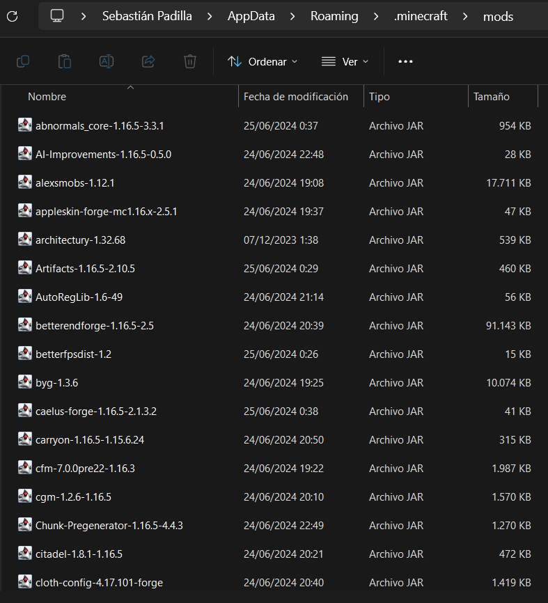

   - Si tu carpeta se ve así, entonces ya estás listo para jugar. La próxima vez que ejecutes Minecraft con el botón JUGAR, se leerán los mods de esta carpeta, lo que te permitirá entrar al servidor sin problemas. Probablemente, al hacerlo, verás el siguiente mensaje en el juego:

   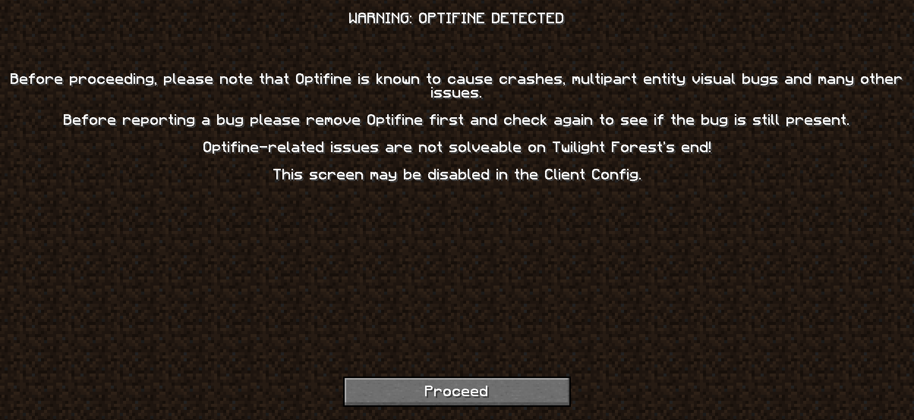

   - Lamentablemente, esta ventana siempre aparecerá cuando inicies el juego. Pero no te preocupes, no es nada grave. Puedes simplemente ignorarla haciendo clic en el botón "Proceed".

**IMPORTANTE:** Si deseas utilizar shaders y/o packs de texturas recomendados (pero no obligatorios) para la experiencia, por favor continúa leyendo los siguientes pasos. De lo contrario, ve al apartado de "Paso a Paso (Rendimiento)".

## Instalación de Shaders y Packs de Texturas (Opcional)

### Paso a Paso (Pack de Texturas)

1. **Abrir la carpeta de Resource Packs**:
   - Dentro del launcher, haz clic en "Options", luego en "Resource Packs", y luego en "Open Pack Folder", en la parte inferior izquierda. Se abrirá una carpeta vacía.

2. **Copiar los Resource Packs**:
   - Una vez dentro de la carpeta, copia todos los archivos que hay dentro de la carpeta "resourcepacks andes" que instalaste al inicio y pégalos todos en la carpeta vacía que acabas de abrir.

3. **Activar los Resource Packs**:
   - Vuelve al juego. Verás que en el apartado "Available", ahora hay nuevos archivos.

   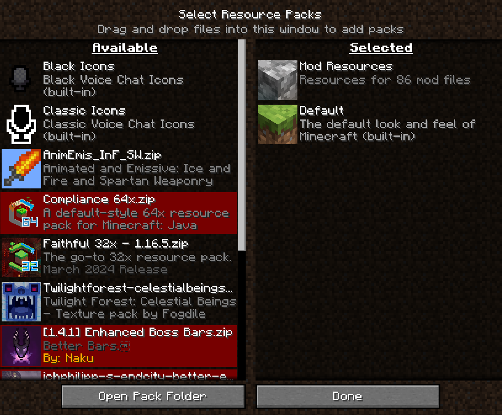

   - Si colocas el mouse sobre ellos, verás que aparece una flecha que apunta hacia la derecha. Haz clic en dicha flecha en los archivos necesarios para que la pestaña del juego se vea así:

   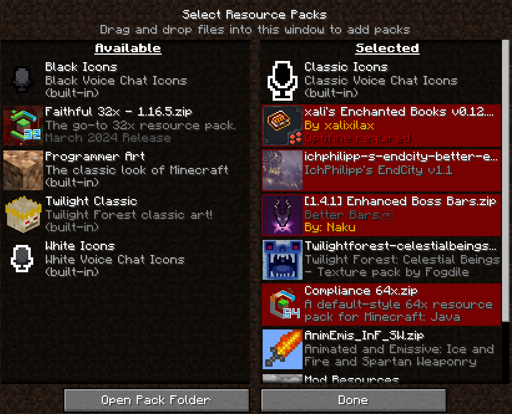

   - **Nota 1:** Al intentar mover los archivos en rojo, verás que aparece un mensaje. Ignóralo, presionando el botón "Yes". Independientemente de lo que indique, no genera ningún problema dentro del juego.

     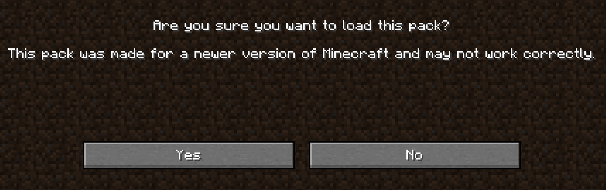

   - **Nota 2:** Si tu computadora es de gama baja, puedes mover a la derecha el archivo `Faithful 32x - 1.16.5` en vez del archivo `Compliance 64x`. Si dejas el archivo `Faithful 32x - 1.16.5` a la derecha, entonces `Compliance 64x` debe permanecer en la izquierda. **No los coloques ambos al mismo tiempo en el lado derecho.**

4. **Finalizar**:
   - Haz clic en "Done", espera a que cargue, ¡y listo! Los packs de texturas están listos. Ahora Minecraft se verá más prolijo.

### Paso a Paso (Shaders)

1. **Abrir la carpeta de Shaders**:
   - Vuelve nuevamente al menú de Minecraft. Haz clic en "Options", luego en "Video Settings", y finalmente en "Shaders". Haz clic en el botón de abajo a la izquierda que dice "Shaders Folder". Se abrirá una carpeta vacía.

2. **Copiar los Shaders**:
   - Una vez dentro de la carpeta, copia todos los archivos que hay dentro de la carpeta "shaderpacks andes" que instalaste al inicio y pégalos todos en la carpeta vacía que acabas de abrir.

3. **Verificar la instalación**:
   - Si has hecho todo bien, el juego debería verse así:

   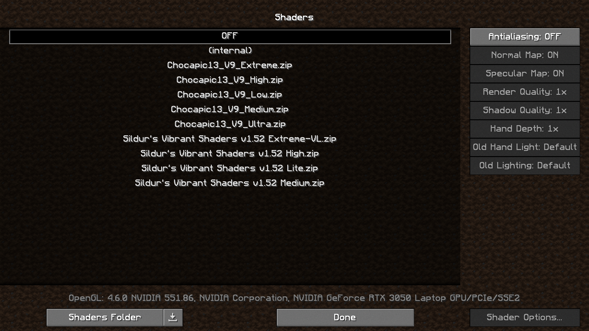

4. **Probar el rendimiento de los shaders**:
   - Este paso es muy importante. Como mencioné anteriormente, los shaders exigen muchos recursos, y si no estás seguro de cómo lidia tu computadora con ellos, tu mejor opción es que crees un mundo en modo creativo, y luego pruebes los shaders, ya que esto te hará saber de inmediato cómo impactan los shaders en el rendimiento del juego. Ve al menú inicial, luego haz clic en "Singleplayer", luego abajo a la derecha donde dice "Create New World". En "Game Mode: Survival", haz clic hasta que diga "Game Mode: Creative". Luego, haz clic abajo a la izquierda en "Create New World". Si te aparece el siguiente mensaje, haz clic en "I know what I'm doing!"

   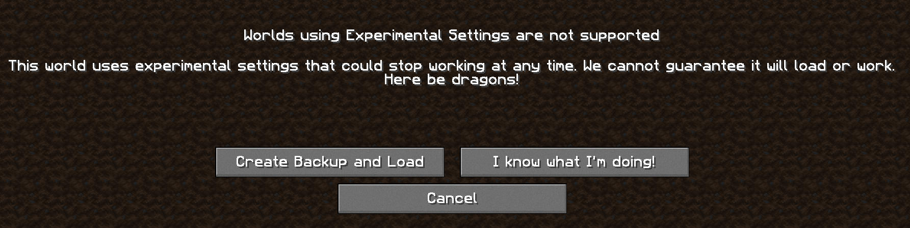

5. **Verificar el rendimiento en el juego**:
   - Seguramente se tardará unos minutos en crear tu mundo. No te preocupes, es normal. Una vez dentro del juego, presiona la tecla F3. Verás un montón de texto en tu pantalla, sin embargo, en la parte superior izquierda, en la segunda línea, verás un número en constante cambio que indica tus fps (fotogramas por segundo). Si estás cerca de 120 fps o superior, entonces estás en perfectas condiciones para probar los shaders. Si está debajo de 80 fps, probablemente no sea una buena idea usar shaders.

6. **Seleccionar los shaders**:
   - Si estás en condiciones de usar shaders, entonces presiona el botón Esc (Escape). Ve a "Options", luego a "Video Settings", y finalmente a "Shaders".

   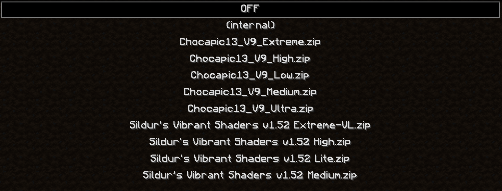

7. **Elegir el conjunto de shaders**:
   - Una vez ahí, verás que los shaders se distribuyen en dos conjuntos principales: Chocapic13 y Sildur's Vibrant. Los primeros son shaders bastante ligeros, mientras que Sildur's consumen muchos más recursos. Dentro de estos mismos conjuntos, verás que al final del nombre hay algunos indicativos sobre la calidad del shader, que en orden descendente van así:

     - Ultra
     - Extreme
     - High
     - Medium
     - Low/Lite

8. **Aplicar los shaders**:
   - Elige alguno de los dos conjuntos, dependiendo de la potencia de tu computadora. Chocapic13 son ligeros, y los Sildur's son exigentes. Dentro de estos mismos conjuntos, están los indicativos descritos anteriormente, donde Ultra es muy exigente y Low/Lite es lo menos exigente. Haz clic en la opción Low/Lite de alguno de los dos conjuntos, espera a que cargue (probablemente tarde varios segundos), y haz clic en el botón "Done". Luego, observa tus fps. Si están oscilando en 40 fps o más, entonces estás perfecto. Si están oscilando en menos de 30, entonces es mejor que juegues sin shaders. Si tienes más de 70 fps, entonces podrías considerar opciones más exigentes, que mejorarán la calidad.

9. **Consideraciones adicionales**:
   - Un punto adicional a destacar es que los shaders Sildur's Vibrant suelen estropear la imagen al entrar a dimensiones como el Nether o el End. Si no planeas visitar frecuentemente estas dimensiones en algún punto del juego, te recomiendo cambiarte a los Chocapic13. De lo contrario, entonces puedes conservarlo, pues las vistas del Overworld son hermosas con dichos shaders. Independientemente de tu decisión, siempre puedes cambiarlos o quitarlos en el mismo menú de shaders.

### Paso a Paso (Rendimiento)

A continuación, te muestro algunas opciones adicionales que ayudan a tener una experiencia de juego más dinámica.

1. **Acceder a las opciones de video**:
   - En el menú o dentro del juego (con el botón Escape), haz clic en "Options" y luego "Video Settings".

   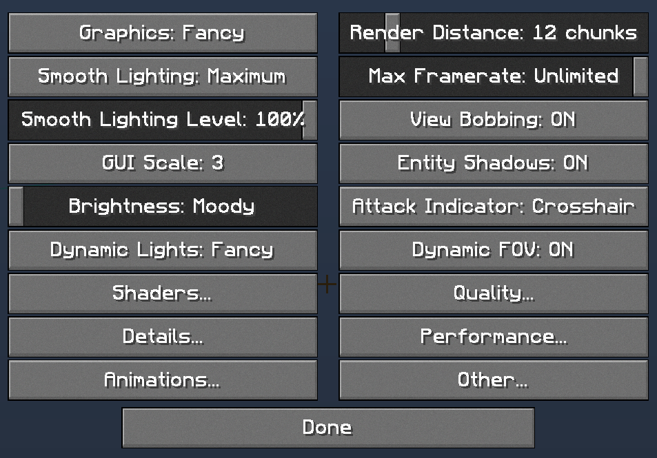

2. **Ajustar las opciones de video**:
   - Dentro de las muchas opciones, puedes:

     - Bajar la barra de "Render Distance" a 8 o 6, según necesites. Esto incrementa considerablemente tus fps.
     - Presionar el botón "Dynamic Lights: OFF", y cambiarlo según estimes conveniente. Fast para bajo impacto, y Fancy para impacto medio. Lo que hace esta opción es hacer que las luces sean dinámicas, lo que te permite, por ejemplo, sujetar una antorcha en tu mano para iluminar el camino, sin necesidad de colocarla. Se recomienda no tenerla en OFF para mejorar la experiencia.
     - Haciendo clic en "Performance", puedes cambiar la configuración haciendo clic sobre los botones que aparecen. Te recomiendo dejarlo de la siguiente forma para un mejor rendimiento:

       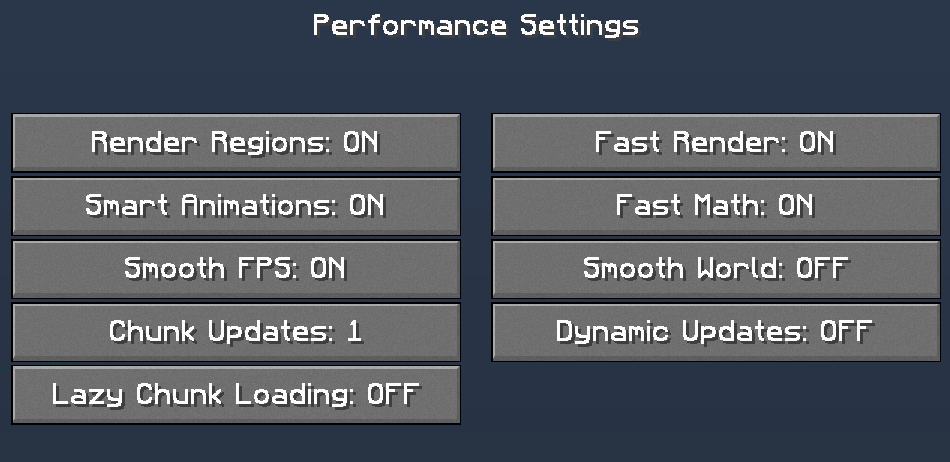

#### Opciones adicionales para mejorar el rendimiento

1. **No usar ni packs de texturas ni shaders**:
   - Esto puede mejorar significativamente el rendimiento del juego.

2. **Reducir las partículas**:
   - Además de las opciones del apartado anterior, puedes hacer clic en "Animations". En la parte inferior derecha, donde dice "Particles: All", puedes hacer clic hasta que diga "Minimal".

3. **Ajustar la calidad de renderizado y sombras**:
   - Si necesitas un mejor rendimiento en demasía, como último recurso puedes ir a la pestaña Shaders. En la lista de shaders, haz clic en (internal). Una vez que cargue, verás que ahora están disponibles nuevas opciones:

     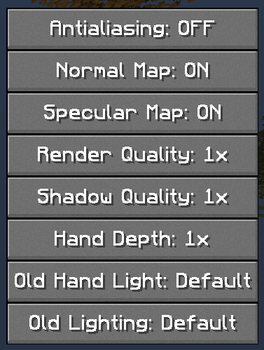

4. **Reducir la calidad de renderizado y sombras**:
   - Haz clic DERECHO sobre las opciones "Render Quality" y "Shadow Quality". El número irá bajando. Esto baja considerablemente la calidad de imagen y de las sombras del juego, pero aumenta muchísimo la fluidez del mismo. Bájalo hasta donde estimes conveniente (el valor más bajo es 0.5 = 50%).

5. **Asistencia adicional**:
   - Si tu rendimiento sigue siendo bajo después de todos estos pasos, comunícate en Discord con LemonDemon.

---

Aquí acaba el tutorial de instalación. Para cualquier duda con el procedimiento de cualquier apartado, por favor comunícate en Discord con LemonDemon. ¡GLHF!

